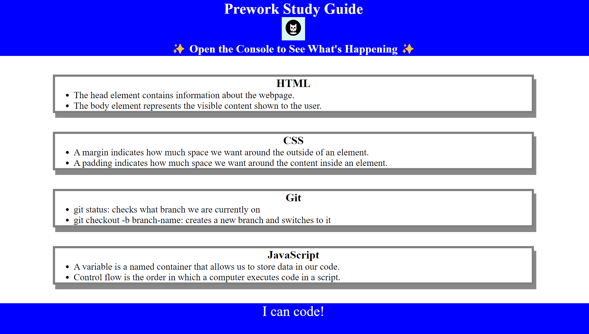

  
  # [Boot Camp Prework Study Guide](https://ndleah.github.io/prework-study-guide/)

  
  
  
  

## Description

> This study guide collects and organizes the most important learning concepts from my prework modules in my full stack flex bootcamp. Topis include Git, HTML, CSS, and JavaScript.  
> 
> I deepened my understanding of the topic's key concepts by putting newly acquired skills into action. I also became more familiar with **GitBash**, **VSCode**, **Google Chrome Dev**, **Git flow**, and a variety of keyboard shortcuts.
## Table of Contents
* [Usage](#usage)
* [License](#license)
* [Contact](#contact)

## Usage

The guide is organized into four study areas for student review including Git, HTML, CSS, and Javascript:

1. First, visit the webpage and open the DevTools console by pressing `Control+Shift+I` (Windows) or `Command+Option+I` (MacOS). 

2. Next, view the "console" tab. JavaScript will randomly pick one of the four content areas for you to study first. A new random selection is made when the page is refreshed. 

## License
[MIT License](https://opensource.org/licenses/MIT)

## Contact
* Email nduongthucanh@gmail.com
* LinkedIn [https://www.linkedin.com/in/ndleah/](https://www.linkedin.com/in/ndleah/)
